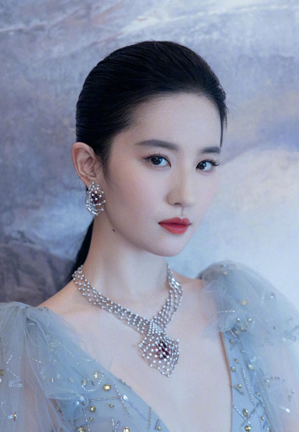
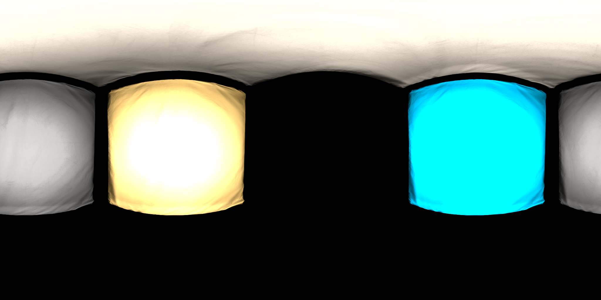
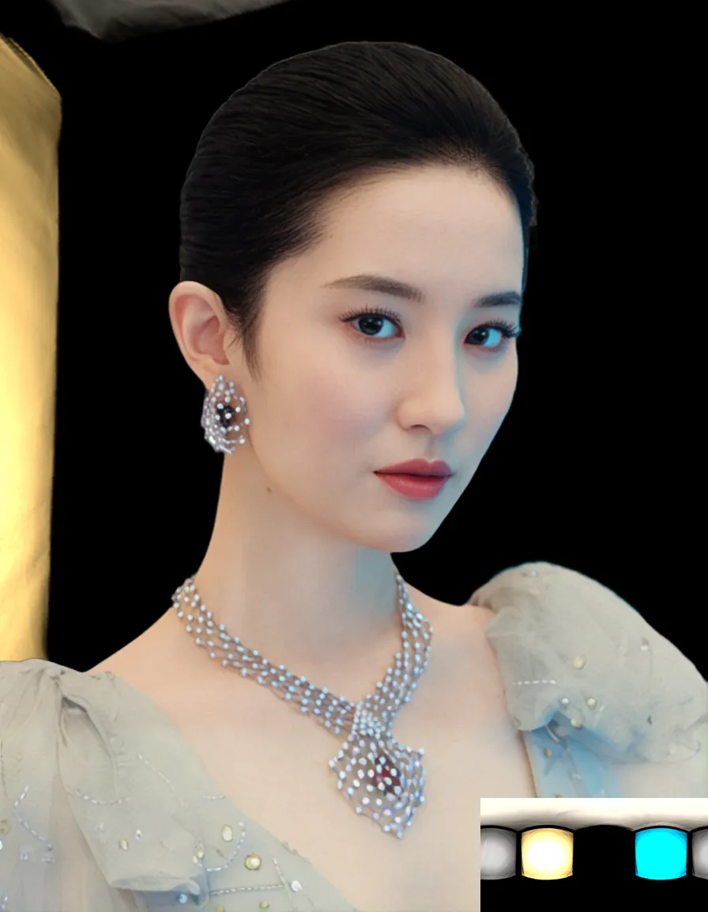

# Relight-HDRI

## Introduction
*  **Relight-HDRI** is applied to the task of relighting using HDRI environments. 
* The model is a diffusion model based on Latent Bridge Matching (LBM) and SDXL.
* The model is trained from scratch using our custom dataset.
* The model is able to synthesize images with accurate illumination direction and high-quality shadow rendering.

## Updates


## Examples
The input is a foreground image and a ldr panorama image converted from an HDRI file (the width is twice the height). The model suppose that relighting result of the foreground is at center of the panorama image.




The output is a relighting foreground compositing the projected image using current FOV and central panorama image content. And the left-bottom corner is the original ldr panorama image.



A 360-degree surround video can be generated by continuously rotating the panoramic image.

<video controls autoplay loop src="./assets/example/example1.mp4" muted="false" width="45%"></video>
<video controls autoplay loop src="./assets/example/example2.mp4" muted="false" width="45%"></video>

<video controls autoplay loop src="./assets/example/example3.mp4" muted="false" width="45%"></video>
<video controls autoplay loop src="./assets/example/example4.mp4" muted="false" width="45%"></video>

<video controls autoplay loop src="./assets/example/example5.mp4" muted="false" width="45%"></video>
<video controls autoplay loop src="./assets/example/example6.mp4" muted="false" width="45%"></video>

<video controls autoplay loop src="./assets/example/example7.mp4" muted="false" width="45%"></video>
<video controls autoplay loop src="./assets/example/example8.mp4" muted="false" width="45%"></video>

## Related Work
* **[SynthLight: Portrait Relighting with Diffusion Model by Learning to Re-render Synthetic Faces](https://vrroom.github.io/synthlight/)**
* **[UniRelight: Learning Joint Decomposition and Synthesis for Video Relighting](https://research.nvidia.com/labs/toronto-ai/UniRelight/)**
* **[DiffusionRenderer: Neural Inverse and Forward Rendering with Video Diffusion Models](https://github.com/nv-tlabs/diffusion-renderer?tab=readme-ov-file#demo-example)**
* **[Neural Gaffer: Relighting Any Object via Diffusion](https://neural-gaffer.github.io/)**
* **[DiLightNet: Fine-grained Lighting Control for Diffusion-based Image Generation](https://dilightnet.github.io/)**


## Contributors
{Xiaodong Xu, Qiuhao Wu, Yujie Xu, Cong Cao, Jing Li} @ AINOVA Teams


##  Citation
```bibtex
@Misc{relighthdri2025,
  author       = {Xiaodong Xu, Qiuhao Wu, Yujie Xu, Cong Cao, Jing Li},
  title        = {Relight-HDRI2025},
  year         = {2025},
  howpublished = {\url{https://github.com/ainova-research/Relight-HDRI}},
  note         = {a model trained for relight using HDRI}
}
```

## Acknowledgement
We thank the authors of [Latent Bridge Matching (LBM)](https://github.com/gojasper/LBM) for their open research and exploration.
